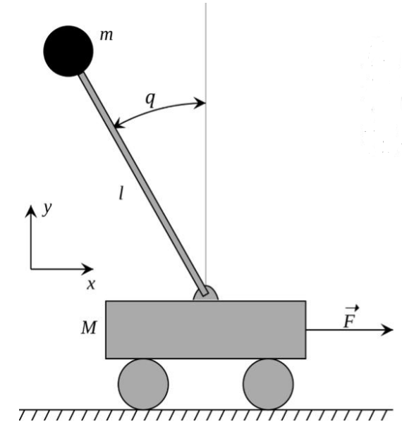

# 一阶倒立摆动力学建模文档

## 物理参数定义
| 参数名称       | 符号表示   | 说明                     |
|---------------|-----------|-------------------------|
| 小车质量        | M         |                          |
| 摆杆质量        | m         | 长度 l，转动惯量 I=1/3ml² |
| 摆杆角度        | θ         | 逆时针方向为正            |
| 小车位移        | x         | 向右为正方向              |
| 外力输入        | F         | 作用于小车的控制力        |
| 地面摩擦系数    | b         |                          |

## 模型示意图
  

小车位移**向右**为**正**，角度**逆时针**为**正**。方向与初始建模时的定义有关，建议建模时小车**位移正方向**与**角度正方向**相**反**
---

## 非线性动力学方程
### 方向1：逆时针角度为正
通过牛顿-欧拉法或拉格朗日方程推导非线性微分方程：
(//i.upmath.me/svg/%5Cbegin%7Baligned%7D%0A(M%2Bm)%20%5Cddot%7Bx%7D-m%20l%20%5Cddot%7B%5Ctheta%7D%20%5Ccos%20%5Ctheta%2Bm%20l%20%5Cdot%7B%5Ctheta%7D%5E%7B2%7D%20%5Csin%20%5Ctheta%20%26%20%3DF%20-b%5Cdot%20x%5C%5C%0A%5Cleft(I%2Bm%20l%5E%7B2%7D%5Cright)%20%5Cddot%7B%5Ctheta%7D-m%20l%20%5Cddot%7Bx%7D%20%5Ccos%20%5Ctheta-m%20g%20l%20%5Csin%20%5Ctheta%20%26%20%3D0%0A%5Cend%7Baligned%7D)
加速度公式：
%20m%20g%20l%20%5Csin%20%5Ctheta%7D%7B(M%20%2B%20m)%5Cleft(I%20%2B%20m%20l%5E2%5Cright)%20-%20m%5E2%20l%5E2%20%5Ccos%20%5Ctheta%5E2%7D)
角加速度公式：
(//i.upmath.me/svg/%5Cddot%7B%5Ctheta%7D%3D%5Cfrac%7B-m%20l%20%5Ccos%20%5Ctheta%20b%20%5Cdot%7Bx%7D-m%5E%7B2%7D%20l%5E%7B2%7D%20%5Csin%20%5Ctheta%20%5Ccos%20%5Ctheta%20%5Cdot%7B%5Ctheta%7D%5E%7B2%7D%2Bm%20l%20%5Ccos%20%5Ctheta%20F%2B(M%2Bm)%20m%20g%20l%20%5Csin%20%5Ctheta%7D%7B(M%2Bm)%5Cleft(I%2Bm%20l%5E%7B2%7D%5Cright)-m%5E%7B2%7D%20l%5E%7B2%7D%20%5Ccos%20%5Ctheta%5E%7B2%7D%7D)

### 方向2：顺时针角度为正
（此处插入角加速度和加速度公式图片链接）

---

## 线性化模型（LQR控制）
### 状态空间方程
（此处插入矩阵A和B的公式图片链接）

---

## LQR位置跟踪实现
通过修改状态向量实现目标位置跟踪：
```cpp
// 代码示例：状态向量偏移
double x_ref = 1.0; // 设定目标位置
x << state[0] - x_ref, state[1], state[2], state[3];
